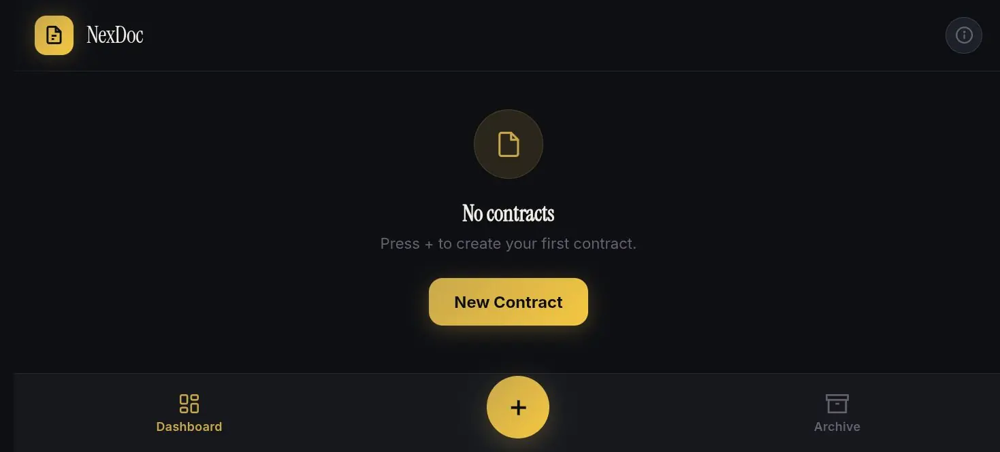

# NexDoc 
**🔗 Live:** [https://cxi5.github.io/nexdoc/](https://cxi5.github.io/nexdoc/)

> Gestão de contratos no browser — sem conta, sem servidor, sem dados a sair do teu dispositivo.

**NexDoc** é uma aplicação web para criar, editar, assinar e arquivar contratos. Foi pensada para quem quer controlo total sobre os documentos: tudo corre no browser e fica guardado apenas no teu telemóvel ou computador (localStorage).

---

## O que faz

1. **Crias** um contrato do zero ou **importas** um ficheiro existente (TXT, HTML ou DOCX).
2. **Editas** com um editor de texto rico: negrito, itálico, sublinhado, títulos, citações, listas (ordenadas e não ordenadas), alinhamento, cores de texto e de fundo, hiperligações.
3. Guardas como **rascunho** ou envias para **assinatura**.
4. **Assinas** desenhando a assinatura digital directamente no ecrã.
5. O documento fica **selado** com um hash SHA-256 do conteúdo — prova de integridade.
6. No final, usas o diálogo de impressão do browser e escolhes **«Guardar como PDF»**.

---

## Funcionalidades principais

| Área | O que inclui |
|------|----------------|
| **Ciclo de vida** | Rascunho → Pendente de assinatura → Assinado. Painel com estatísticas em tempo real. |
| **Arquivo** | Pesquisa, filtros por estado, ordenação por data ou valor. |
| **Moedas** | Selector com mais de 50 moedas (África, Europa, Américas, Ásia). Pesquisa por nome, código, símbolo ou região. |
| **Validade** | Datas de expiração com alerta automático quando faltam 7 dias ou menos. |
| **Logo** | Importas o logótipo da empresa uma vez; aparece no cabeçalho de todos os PDFs. |
| **Backup** | Exportação e restauro em JSON (só os contratos; tema, idioma e logo ficam no dispositivo). |
| **Idiomas** | Português, English, Français, Español — com formatação de datas e números adaptada. |
| **Tema** | Claro e escuro. |

---

## O que o torna diferente

- **100% no dispositivo** — nenhum contrato é enviado para um servidor externo.
- **Sem registo** — abres e usas.
- **Assinatura desenhada** no ecrã + hash SHA-256 para autenticidade do conteúdo.
- **Offline** depois do primeiro carregamento (excepto a primeira importação de DOCX, que precisa da biblioteca mammoth.js via CDN).

---

## Limitações conhecidas

- O editor **não suporta tabelas** (mesmo que apareçam referências noutros materiais).
- Não há navegação por gestos (swipe) nem optimizações específicas para teclado virtual — o toque está optimizado sobretudo no quadro de assinatura.
- A exportação para PDF passa pelo **diálogo de impressão nativo** do browser («Guardar como PDF»). Não é um botão de um clique que gera o ficheiro sozinho.

---

## Privacidade

Os contratos, o logótipo, o tema e o idioma ficam no `localStorage` do browser. Se limpares os dados do site, perdes o que não tiveres exportado em JSON. O backup JSON exporta apenas os contratos — convém fazer backup com regularidade se os documentos forem importantes.
